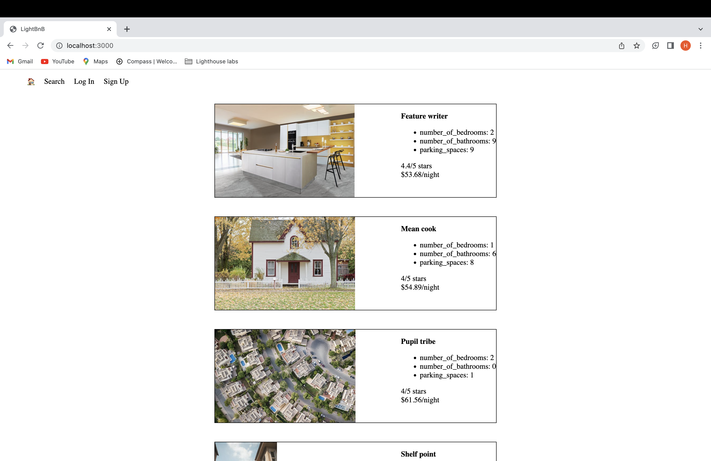
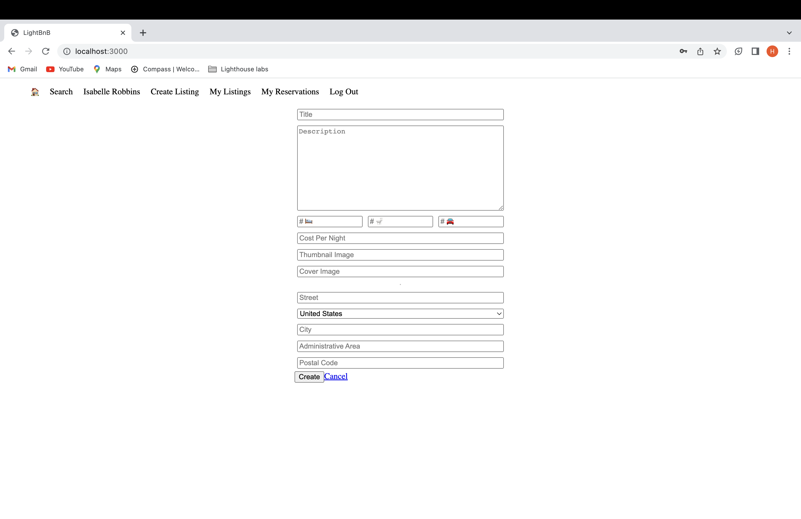

# LighthouseBnB
This project is done for Lighthouse's Web Development course. It allows home owners to rent out their homes to people on vacation, creating an alternative to hotels and bed and breakfasts. A registered user can add new listing/property. A registered and non-registred user can search the properties for a particular city based on price and ratings.

## Final Product
#Homepage

#Add Listing

#SignUp

## Getting Started

1. [Create](https://docs.github.com/en/repositories/creating-and-managing-repositories/creating-a-repository-from-a-template) a new repository using this repository as a template.
2. Clone your repository onto your local device.
3. Install dependencies using the `npm install` command.
3. Start the web server using the `npm run local` command. The app will be served at <http://localhost:3000/>.
4. Go to <http://localhost:3000/> in your browser.

## Dependencies

- Node 5.10.x or above
- cookie-session
- Express
- Nodemon
- bcrypt
- pg

